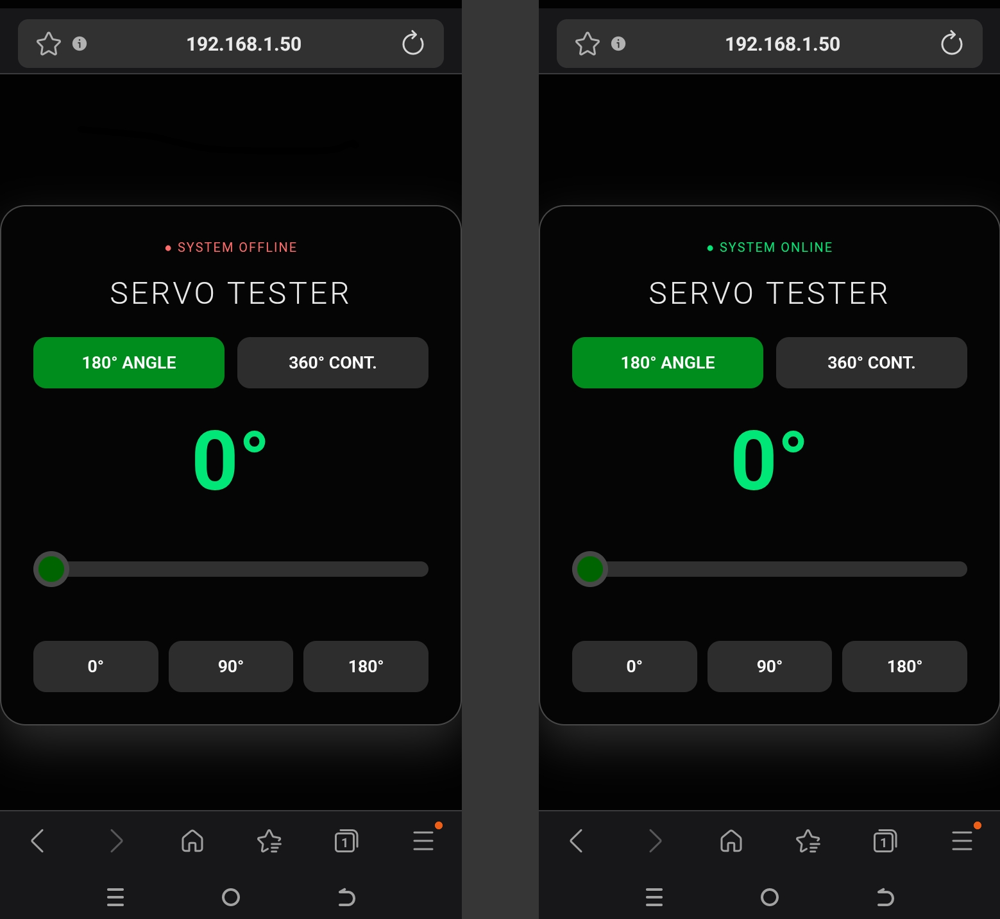
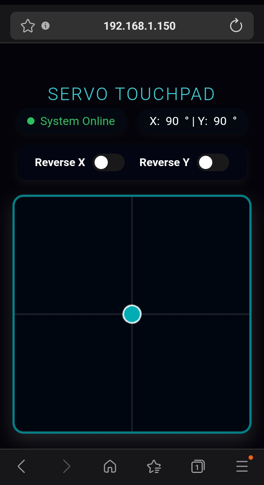

# ESP8266 WebSockets Servo Touchpad Controller

A lightweight, high-performance ESP8266 project that hosts a web-based interactive touchpad UI to control a 2-axis (X-Y) servo setup in real-time. This project uses low-latency WebSockets and includes built-in safety mechanisms.

## 🚀 Features

* **Real-Time Control:** Utilizes WebSockets for ultra-low latency, 40ms sweep transmission.
* **Mobile Friendly:** Responsive HTML5 Canvas touchpad UI with built-in smartphone touch optimization.
* **Axis Inversion:** Invert X or Y controls on-the-fly directly from the web interface.
* **Safety Watchdog:** Automatically centers and parks the servos to `90°` if the connection drops or is idle for more than 3 seconds.
* **Static IP Setup:** Avoids changing IP addresses by locking onto a dedicated static local network configuration.
* **Self-Contained:** The web interface is packed directly into the ESP8266's flash memory (`PROGMEM`)—no external hosting required.

---

## 🛠️ Hardware Requirements

* **Microcontroller:** ESP8266 (NodeMCU, Wemos D1 Mini, etc.)
* **Servos**
    * *Note: Ensure your servos are connected to an appropriate external power source if needed, sharing a common ground with the ESP8266.*

---

## 💻 Software Dependencies

Before uploading the code, ensure you have the following libraries installed in your Arduino IDE:

1.  `ESP8266WiFi` (Built-in)
2.  `ESP8266WebServer` (Built-in)
3.  `Servo` (Built-in)
4.  **WebSockets** by *Markus Sattler* (Search for "Websockets" in the Arduino Library Manager)

---

## ⚙️ Configuration & Installation

1. Clone or download this repository.
2. Open the file in your Arduino IDE.
3. Modify the WiFi credentials and static IP config to match your home router:

```cpp
// WiFi Configuration
const char* ssid = "YOUR_WIFI_SSID";
const char* password = "YOUR_WIFI_PASSWORD";

// Static IP Configuration (Adjust according to your subnet)
IPAddress local_IP(192, 168, 1, 150); 
IPAddress gateway(192, 168, 1, 1);   
IPAddress subnet(255, 255, 255, 0);
```

## ServoTester_ESP8266


---

## Servo_Touchpad

